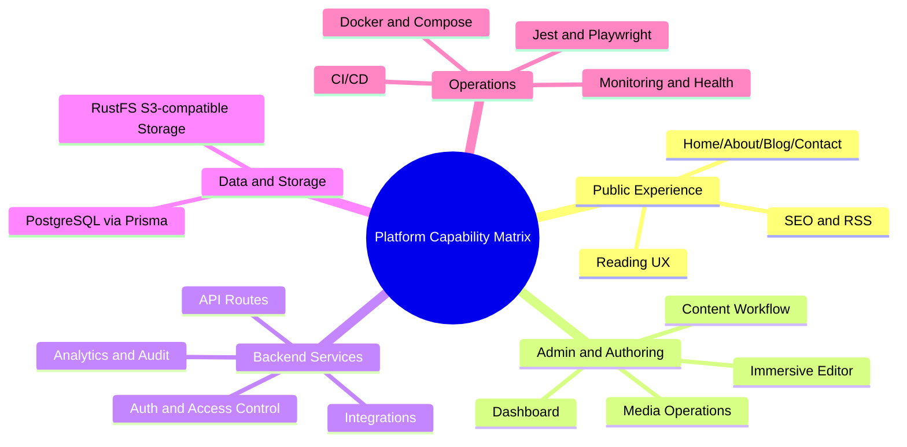
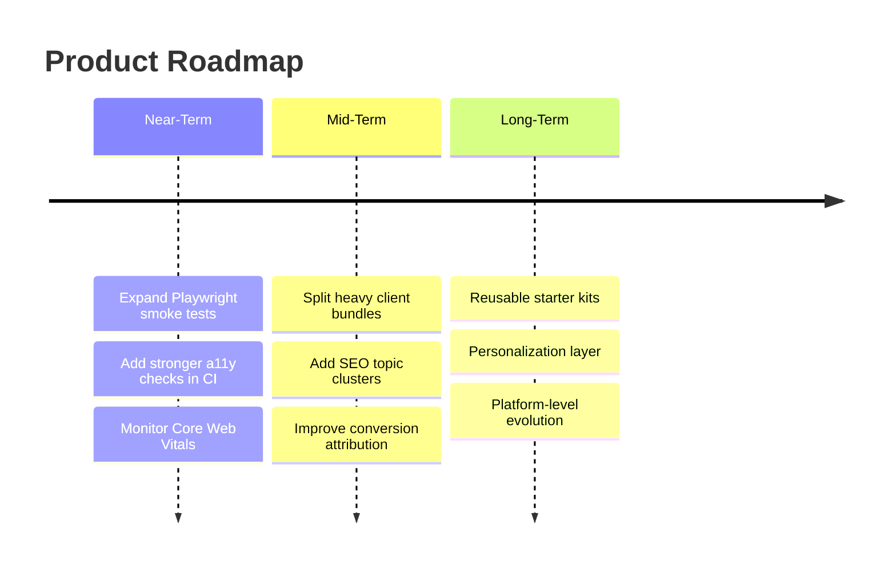
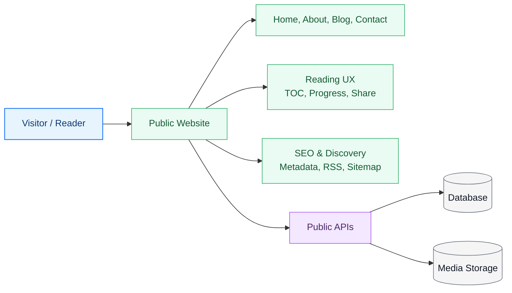
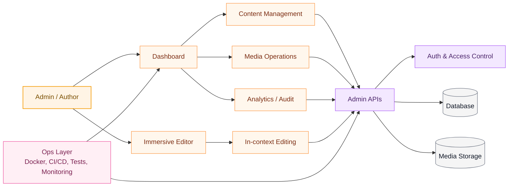
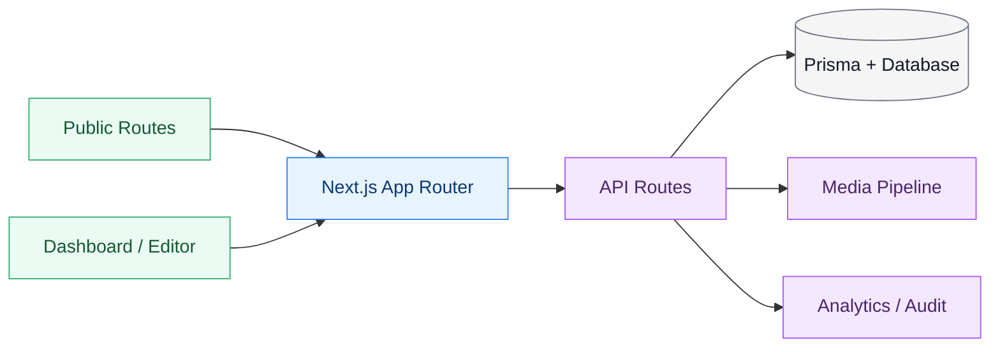

# Building My Personal Website as a Product-Grade Platform
*By* **Benedict Tiong Ing Ngie**

---

> **Introduction**
>
> Most personal websites are static portfolios: a homepage, an about page, and a blog.
>
> I chose a different path.
>
> I engineered my site as a **full-stack publishing and operations platform** - with a production-style dashboard, immersive visual editor, structured content workflows, media management, analytics, access controls, and deployment-ready infrastructure.
>
> This post documents exactly **what features are live**, **what technologies power them**, and **how the system is architected** end-to-end.

---

### Visual Stack Snapshot

### Figure 1A - Visitor (Public) Flow

*(▲ Figure 1A: Visitor-facing flow for reading and discovery.)*

### Figure 1B - Admin (Management) Flow

*(▲ Figure 1B: Admin-facing flow for authoring, operations, and control.)*

---

## 1. Why This Architecture?

A personal site can be either:

1. A simple front-facing page, or
2. A long-term platform you can iterate like a real product.

I optimized for option #2. The design goals were:

- **Fast public UX** (reader-first, SEO-first)
- **Strong authoring workflow** (dashboard + visual editor)
- **Operational control** (health endpoints, logs, backups, security hardening)
- **Extensibility** (integrations, site-scoped modules, optional AI routes)

In short: not just "a website," but a **maintainable content system with product-grade internals**.

---

## 2. Core Stack (What It Uses)

| Layer | Technology | Why It's Used |
| :--- | :--- | :--- |
| **Framework** | Next.js 16 (App Router) | Server-first rendering, route conventions, API routes |
| **Language** | TypeScript | Type safety across UI, API, and utilities |
| **UI** | React 19 + Tailwind CSS 4 + design tokens | Scalable UI system with consistent semantics |
| **Data Access** | Prisma ORM | Structured data model and safer DB access |
| **Database** | PostgreSQL | Primary relational storage for content and operations |
| **Object Storage** | RustFS (S3-compatible) | Media and file asset storage |
| **Auth** | NextAuth | Session management and protected dashboard/editor routes |
| **Abuse Protection** | Turnstile + API rate limiting | CAPTCHA on sign-in path; rate limit on API endpoints (e.g. contact) |
| **Content** | Markdown + MDX pipeline | Rich article rendering and embedded blocks |
| **Media** | Upload + optimization pipeline (`sharp`) | Authoring and delivery pipeline for images/assets |
| **Testing** | Jest + Playwright | Unit/integration tests and E2E smoke tests |
| **Infra** | Docker / Docker Compose | Reproducible local and deployment runtime |
| **Security** | CSP, security headers, `security.txt`, robots/sitemap | Browser hardening and crawler control |
| **Observability** | Sentry + health endpoints | Runtime issue visibility and uptime checks |

*(▲ Figure 2: Capability-oriented technical map from product surface to operations.)*

---

## 3. Public-Site Features (Reader Experience)

### 3.1 Content and Navigation
- Home, About, Blog, Contact, Custom Pages
- Archive and Tag-based blog exploration
- SEO-friendly route structure and canonical metadata

### 3.2 Reading Experience
- Article reading progress and sticky reading chrome
- Table of Contents with active-section highlighting
- Share actions (Web Share + social + URL copy)
- Related post recommendations

*(▲ Figure 3: Reader-facing experience with reading progress, TOC, and share actions.)*

### 3.3 SEO and Discoverability
- `sitemap.xml`, `robots.txt`, RSS feeds (`/feed.xml`, tag feeds)
- Route-level metadata (Open Graph / Twitter cards)
- JSON-LD on key routes (Article and WebPage)
- Tokenized preview routes for unpublished content

### 3.4 Performance-Oriented Rendering
- Server-rendered routes where possible
- Controlled client islands for interactive features
- Bundle analysis support (`npm run analyze`)

---

## 4. Dashboard and Admin Features (Operator Experience)

This is where the site behaves like a product.

### 4.1 Content Management
- Post lifecycle (create/edit/publish/schedule/versioning)
- Notes/drafts separation
- Tag management and cleanup/merge operations
- Custom pages CRUD and ordering

### 4.2 Visual and Immersive Editing
- Immersive editor routes (`/editor/...`)
- In-context editing for Home/About/Contact/custom pages
- Section ordering and visibility controls
- Builder mode and raw markdown mode

### 4.3 Media Operations
- Media upload, cleanup, usage tracking
- URL generation and insertion into content
- Optimization hooks and delivery endpoints

### 4.4 Editorial Tooling
- Content find-and-replace across post bodies
- Inline content editing endpoints
- Revision and restore workflows

### 4.5 Operational Panels
- Analytics dashboard (views/events/path breakdown)
- Audit log views
- Health checks (`/api/live`, `/api/health`)
- Setup and diagnostics surfaces

*(▲ Figure 4: Operator dashboard covering analytics, content, and system operations.)*

---

## 5. API and Backend Capabilities

The backend is not a thin wrapper. It is a modular service layer under `app/api/*`.

Major API domains include:

- **Posts**: publish flows, previews, versions, bulk operations
- **Pages**: custom pages, slug routes, preview tokens
- **Tags**: cleanup and merge support
- **Media**: upload/serve/cleanup/usage
- **Analytics**: event capture, stats, retention/clear controls
- **Auth and Security**: session and abuse-protection checks
- **Site Config / Site Content**: centralized rendering configuration
- **Integrations**: package ecosystem and site-scoped modules

This separation keeps rendering concerns and management concerns cleanly isolated.

---

## 6. CI/CD, Verification, and Reliability

### 6.1 Build and Quality Gates
- `lint`, `typecheck`, `test`, `build` scripts
- `verify` command as pre-release quality gate

### 6.2 E2E Coverage
- Playwright smoke tests in `e2e/` currently cover:
  - Home / Blog / Contact
  - Auth sign-in entry
  - Dashboard entry redirect behavior

### 6.3 Runtime Hardening
- CSP and hardened security headers in Next config
- Optional HSTS toggle for HTTPS production deployments

### 6.4 Monitoring and Health
- Sentry integration for runtime issue capture
- Health endpoints for uptime checks and automation probes

*(▲ Figure 5: Verification pipeline from lint/typecheck/test to production build and monitoring.)*

---

## 7. Design System and UI Engineering Notes

I recently completed a major UI architecture uplift:

- Replaced hardcoded color classes with semantic design tokens
- Unified public layout primitives (`PublicPageShell`, `PublicSection`, etc.)
- Standardized dashboard page headers and empty states
- Preserved a deliberate **light-only design** (no dark mode in current strategy)

This improves consistency now and reduces maintenance cost over time.

---

## 8. Data Layer and Content Model

At the data level, the platform is Prisma-backed and organized around content plus operations:

- Posts, tags, versions, previews
- Custom pages and page revisions
- Site config and route-level content settings
- Audit and analytics records
- Media assets and usage references

The model emphasizes editorial safety, operational visibility, and extensibility.

---

## 9. What This Website Is (And Is Not)

This website **is**:

- A personal brand surface
- A technical writing platform
- A lightweight CMS + visual editing system
- A production-practice sandbox for full-stack engineering

This website is **not**:

- A static one-time portfolio
- A no-code template
- A frontend-only project without operations depth

---

## 10. What's Next (Roadmap)

### Near-Term
- Expand Playwright smoke coverage across more dashboard/editor critical paths
- Add stronger accessibility checks in CI
- Track Core Web Vitals (LCP/CLS) continuously

### Mid-Term
- Split heavy client bundles further
- Add structured SEO topic clusters
- Improve contact/conversion attribution

### Long-Term
- Extract reusable starter-kit modules
- Add richer personalization/recommendation features
- Evolve from personal site into a reusable platform architecture

---

## Conclusion

I built this project to prove a point:

> A personal website can be treated with the same engineering rigor as a production product.

By combining modern web architecture, a robust admin/editor workflow, operational tooling, and systematic quality gates, this platform became more than a portfolio - it became a **living full-stack system**.

If you are building your own site, my biggest recommendation is simple:

**Do not just design pages. Design workflows, reliability, and iteration velocity.**

---
title: "Building My Personal Website as a Product-Grade Platform"
slug: "personal-website-product-grade-platform"
description: "How I built my personal website as a full-stack platform."
tags: "Next.js, TypeScript, Prisma, React, Tailwind CSS, Docker, CI/CD, Playwright, Jest, SEO, Web Performance, Full-Stack, Personal Website, Engineering Blog"
published: true
language: "en"
---

# Building My Personal Website as a Product-Grade Platform  
*By* **Benedict Tiong Ing Ngie**

---

> **Introduction**
>
> Most personal websites are static portfolios: a homepage, an about page, and a blog.  
>  
> I chose a different path.  
>  
> I engineered my site as a **full-stack publishing and operations platform** — with a production-style dashboard, immersive visual editor, structured content workflows, media management, analytics, access controls, and deployment-ready infrastructure.  
>  
> This post documents exactly **what features are live**, **what technologies power them**, and **how the system is architected** end-to-end.

---

### Visual Stack Snapshot

### Figure 1A — Visitor (Public) Flow

*(▲ Figure 1A: Visitor-facing flow for reading and discovery.)*

### Figure 1B — Admin (Management) Flow

*(▲ Figure 1B: Admin-facing flow for authoring, operations, and control.)*

---

## 1. Why This Architecture?

A personal site can be either:

1. A simple front-facing page, or  
2. A long-term platform you can iterate like a real product.

I optimized for option #2. The design goals were:

- **Fast public UX** (reader-first, SEO-first)
- **Strong authoring workflow** (dashboard + visual editor)
- **Operational control** (health endpoints, logs, backups, security hardening)
- **Extensibility** (integrations, site-scoped SaaS modules, and optional AI routes)

In short: not just “a website,” but a **maintainable content system with product-grade internals**.

> **Tip:** If you want this section to be visually stronger, add a simple comparison graphic:
> - Left: “Traditional Portfolio”
> - Right: “Product-Grade Platform”
> - Metrics: maintainability, extensibility, operations visibility

---

## 2. Core Stack (What It Uses)

| Layer | Technology | Why It’s Used |
| :--- | :--- | :--- |
| **Framework** | Next.js 16 (App Router) | Server-first rendering, route conventions, API routes |
| **Language** | TypeScript | Type safety across UI, API, and utilities |
| **UI** | React 19 + Tailwind CSS 4 + design tokens | Scalable UI system with consistent semantics |
| **Data Access** | Prisma ORM | Structured data model and safer DB access |
| **Auth** | NextAuth | Session management and protected dashboard/editor routes |
| **Abuse Protection** | Cloudflare Turnstile + API rate limiting | Turnstile is used in sign-in flow; contact/API endpoints are protected with rate limits |
| **Content** | Markdown + MDX pipeline | Rich article rendering and embedded dynamic blocks |
| **Media** | Upload + optimization pipeline (`sharp`) | Image handling for authoring and public delivery |
| **Storage** | PostgreSQL + RustFS (S3-compatible) | Relational content data in Postgres; object/media assets in RustFS |
| **Observability** | Sentry + health endpoints | Runtime error capture and production diagnostics |
| **Testing** | Jest + Playwright | Unit/integration + smoke E2E coverage |
| **Infra** | Docker / Docker Compose | Local reproducibility and deployment portability |
| **Security** | CSP, strict headers, security.txt, robots/sitemap | Browser hardening and SEO/crawler controls |

*(▲ Figure 2: Technology stack map from UI to infrastructure.)*

---

## 3. Public-Site Features (Reader Experience)

### 3.1 Content & Navigation
- Home, About, Blog, Contact, Custom Pages
- Archive and Tag-based blog exploration
- SEO-friendly route structure and canonical metadata

### 3.2 Reading Experience
- Article reading progress and sticky reading chrome
- Table of Contents with active-section highlighting
- Copy/share actions (Web Share + social + URL copy)
- Related post recommendations

*(▲ Figure 3: Reader-facing experience with reading progress, TOC, and share actions.)*

### 3.3 SEO & Discoverability
- `sitemap.xml`, `robots.txt`, RSS feeds (`/feed.xml`, tag feeds)
- Route-level metadata (Open Graph / Twitter cards)
- JSON-LD on key content routes (Article/WebPage context)
- Preview routes for unpublished content (tokenized)

### 3.4 Performance-Oriented Rendering
- Server-rendered pages where possible
- Controlled client components for interactive zones only
- Bundle analysis support for optimization (`npm run analyze`)

---

## 4. Dashboard & Admin Features (Operator Experience)

This is where the site behaves like a product.

### 4.1 Content Management
- Post lifecycle (create/edit/publish/schedule/versioning)
- Notes/drafts separation
- Tag management and tag cleanup/merge operations
- Custom pages CRUD and ordering

### 4.2 Visual & Immersive Editing
- Immersive editor routes (`/editor/...`)
- In-context editing for Home/About/Contact/custom pages
- Section ordering and visibility controls
- Builder-style and raw markdown editing modes

### 4.3 Media Operations
- Media upload, cleanup, usage tracking
- URL generation and insertion into content
- Optimization hooks and delivery endpoints

### 4.4 Editorial Tooling
- Content find-and-replace across posts
- Inline content editing endpoints
- Revision and restore workflows

### 4.5 Operational Panels
- Analytics dashboard (views/events/path breakdown)
- Audit log views
- Health checks (`/api/health`, `/api/live`)
- Setup workflows and diagnostics surfaces

*(▲ Figure 4: Operator dashboard covering analytics, content, and system operations.)*

---

## 5. API & Backend Capabilities

The backend is not a thin wrapper — it is a full modular service layer under `app/api/*`.

Major API domains include:

- **Posts**: publish flows, previews, versions, bulk ops
- **Pages**: custom pages, slug routes, preview tokens
- **Tags**: CRUD-like support, cleanup/merge
- **Media**: upload/serve/cleanup/usage
- **Analytics**: event capture, stats, retention/clear controls
- **Auth & Security**: session paths, CAPTCHA-required checks
- **Site Config / Site Content**: centralized config and page content
- **Integrations**: package ecosystem connectors (GitHub/npm/PyPI/etc.)
- **SaaS Namespace**: site-scoped APIs for commerce/CRM/AI/workflows

This separation enables clear boundaries between content rendering and management logic.

---

## 6. CI/CD, Verification, and Reliability

### 6.1 Build & Quality Gates
- `lint`, `typecheck`, `test`, `build` scripts
- Composite `verify` command for pre-release confidence

### 6.2 E2E Coverage
- Playwright smoke tests in `e2e/` currently cover:
  - Home / Blog / Contact
  - Auth sign-in entry
  - Dashboard entry redirect behavior

### 6.3 Runtime Hardening
- Secure HTTP headers in Next config:
  - CSP
  - X-Frame-Options
  - Referrer-Policy
  - Permissions-Policy
- Optional HSTS toggle for HTTPS production

### 6.4 Error Monitoring
- Sentry integration for runtime issue capture
- Health endpoints (`/api/live`, `/api/health`) for uptime checks

*(▲ Figure 5: Verification pipeline from lint/typecheck/test to production build and monitoring.)*

---

## 7. Design System & UI Engineering Notes

I recently completed a major UI architecture uplift:

- Replaced hardcoded color classes with semantic design tokens
- Unified public layout primitives (`PublicPageShell`, `PublicSection`, etc.)
- Standardized dashboard page headers and empty states
- Preserved **light-only design** intentionally (no dark mode in current strategy)

This gives me consistency now and lower maintenance cost later.

---

## 8. Data Layer & Content Model

At the data level, this platform is Prisma-backed and organized around content + operations entities:

- Posts, tags, versions, previews
- Custom pages and page revisions
- Site config and route-level content settings
- Audit/analytics records
- Media assets and usage references

The model is designed for editorial safety (versionability), operational visibility, and future extension.

---

## 9. What This Website Is (And Is Not)

This website **is**:

- A personal brand surface
- A technical writing platform
- A lightweight CMS + visual editing system
- A production-practice sandbox for full-stack engineering

This website is **not**:

- A static one-time portfolio
- A no-code template
- A front-end-only project without operations depth

---

## 10. What’s Next (Roadmap)

### Near-Term
- Expand Playwright smoke suite across more dashboard/editor critical paths
- Add more strict accessibility checks in CI
- Track Core Web Vitals continuously (LCP/CLS budgets)

### Mid-Term
- Deeper bundle splitting for heavy client islands
- More structured SEO templates for topic clusters
- Better analytics attribution for contact and conversion paths

### Long-Term
- Turn selected internal modules into reusable starter kits
- Add richer personalization and recommendation layers
- Evolve from “personal site” into a reusable **content platform architecture**

---

## Conclusion

I built this project to prove a point:

> A personal website can be treated with the same engineering rigor as a production product.

By combining modern web architecture, a robust admin/editor workflow, operational tooling, and systematic quality gates, this platform became more than a portfolio — it became a **living full-stack system**.

If you’re building your own site, my biggest recommendation is simple:

**Don’t just design pages. Design workflows, reliability, and iteration velocity.**  
That’s where long-term value compounds.
