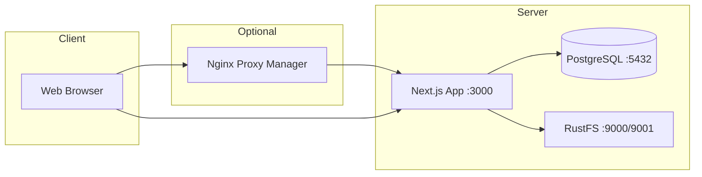
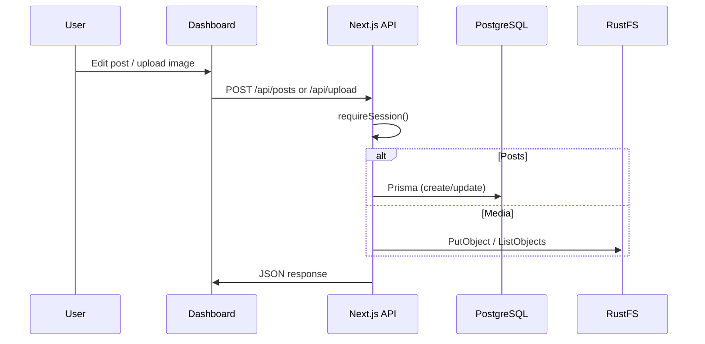
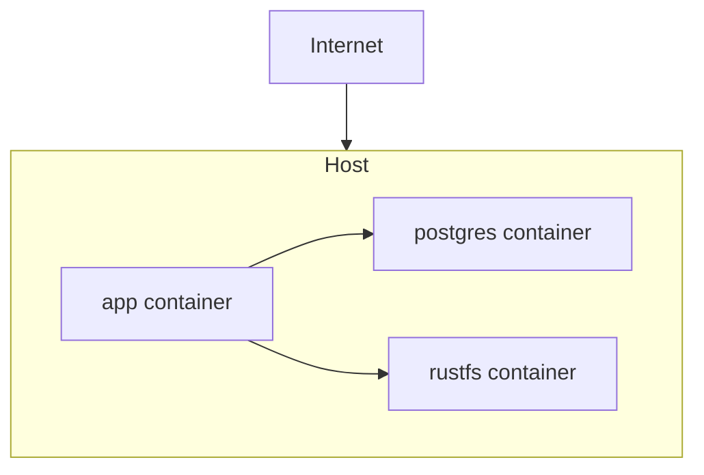

# System Architecture

This document describes the high-level architecture, design decisions, and data flow of the personal website and its dashboard.

---

## High-level architecture

The system consists of a single Next.js application (SSR + API routes), a PostgreSQL database, and an S3-compatible object store (RustFS). Optionally, a reverse proxy (e.g. Nginx Proxy Manager) sits in front for SSL and routing.

*Insert diagram: High-level deployment (Browser → optional NPM → Next.js; Next.js → Postgres + RustFS).*

---

## Component overview

| Component | Role | Technology |
|-----------|------|------------|
| **Next.js app** | SSR pages, API routes, dashboard UI, auth (NextAuth) | Next.js 16 (App Router), React 19 |
| **PostgreSQL** | Persistent data: posts, tags, site config, custom pages, About config, analytics, versions | Prisma ORM, Prisma Migrate |
| **RustFS** | Binary storage for media (images, uploads) | S3 API; app uses AWS SDK |
| **Reverse proxy** | TLS termination, host-based routing (optional) | Nginx Proxy Manager or any HTTP reverse proxy |

---

## Data flow

### Public site (read path)

- **Home:** App reads `SitePageContent` (page = `home`) and `SiteConfig` from DB, fetches latest posts from `Post`, renders sections (hero, latest posts, skills) according to `sectionOrder` and `sectionVisibility`.
- **Blog:** App reads `Post` (published) and `Tag`, renders list and post pages; Markdown is rendered with rehype/remark (highlight, math, etc.).
- **About:** App reads `AboutConfig` (profile, blocks, skills, achievements) and `sectionOrder` / `sectionVisibility`, renders sections in order.
- **Contact:** App reads contact config; form POST goes to `/api/contact`, which sends email via Resend or SMTP.
- **Custom pages:** App reads `CustomPage` by slug and renders Markdown at `/page/[slug]`, including scheduled publish logic (`effectivePublished`) and metadata stripping for public output.

### Dashboard (authenticated write path)

- **Auth:** User submits password at `/auth/signin`; NextAuth credentials provider checks `ADMIN_PASSWORD` (env), creates session. Middleware protects `/dashboard/*` and relevant API routes.
- **Posts:** CRUD via `/api/posts`, `/api/posts/[id]`; version history in `PostVersion`; preview tokens for draft sharing.
- **Media:** Upload to S3 (RustFS) via `/api/upload`; listing and delete via `/api/media`; serving via `/api/media/serve/[filename]`.
- **Media optimization:** `/api/media/optimize` supports both dry-run assessment and real optimization execution with audit records.
- **Site config:** Single row in `SiteConfig` (id = 1); PATCH via `/api/site-config`. Drives nav, footer, meta, template, theme.
- **Home / Contact content:** Stored in `SitePageContent` (page = `home` | `contact`); PATCH via `/api/site-content`.
- **About:** Stored in `AboutConfig` (single row); PATCH via `/api/about/config`. Section order/visibility in `sectionOrder` / `sectionVisibility` columns.
- **Custom pages:** CRUD and reorder via `/api/custom-pages`, plus preview-token and scheduled publish support.
- **Audit:** Operational actions are written to `AuditLog` and surfaced in `/dashboard/audit`.

*Insert diagram: Dashboard → API (auth) → DB or S3.*

---

## Database schema (summary)

- **Post:** id, title, slug, content, description, published, pinned, category, order, previewToken, timestamps; relation to Tag (many-to-many).
- **Tag:** id, name, slug; relation to Post.
- **PostVersion:** version history for posts (title, slug, content, tags, versionNumber).
- **SiteConfig:** singleton (id = 1); siteName, logoUrl, faviconUrl, metaTitle, metaDescription, authorName, links (JSON), navItems (JSON), footerText, ogImageUrl, setupCompleted, templateId, themeMode, autoAddCustomPagesToNav.
- **SitePageContent:** keyed by `page` (`home` | `contact`); `content` JSON (e.g. hero, CTAs, sectionOrder, sectionVisibility for home).
- **CustomPage:** id, slug, title, content (Markdown + schedule metadata marker), order, published.
- **AboutConfig:** singleton; profileImage, hero fields, introText, educationBlocks / experienceBlocks / projectBlocks (JSON), technicalSkills, achievements, sectionOrder, sectionVisibility, contactLinks, etc.
- **Analytics:** page views (path, IP, country, etc.) for dashboard analytics.
- **AuditLog:** action-level event log with actor, resource, details, and timestamp.

---

## Why the dashboard is designed this way

1. **Single-tenant, single admin:** One site, one credentials user. No multi-user or RBAC; keeps auth and UI simple while still allowing full content control.
2. **No-code first:** Setup wizard, inline help (FieldHelp), drag-and-drop nav and section order, templates (Personal / Portfolio / Blog), and Markdown with “Insert image” / “Insert button” let non-developers manage content. Technical users can still edit raw Markdown and use the same APIs.
3. **Configuration as data:** Site config, home content, About, and custom pages are stored in the DB (or JSON columns), not in code. Changing nav, sections, or copy does not require a deploy.
4. **Separation of concerns:** Public site is read-heavy and cache-friendly; dashboard and API are protected and write to DB/S3. Clear split between “what visitors see” and “what the admin edits.”
5. **Extensibility:** Custom pages (Markdown + slug), section order/visibility, and templates allow layout and content variety without new routes or components for every new page.

---

## Security

- **Auth:** NextAuth session; middleware denies unauthenticated access to `/dashboard/*` and write APIs. Session expiry and re-login flow are implemented.
- **Secrets:** Passwords and keys live in environment variables (or secrets manager in production); never committed.
- **Input:** API routes validate and sanitize input; Prisma parameterizes queries.
- **Proxy:** In production, the app is behind a reverse proxy; TLS and WAF (e.g. Cloudflare) can be added at the edge.

---

## Deployment topology (Docker Compose)

- **app:** Builds from Dockerfile (Next.js standalone); receives `DATABASE_URL`, S3 env, NextAuth env from Compose (from `.env`).
- **postgres:** Data in `./postgres-data`.
- **rustfs:** Data in `./rustfs-data`, logs in `./rustfs-logs`. Bucket `uploads` created on first upload if missing.

Migrations are run inside the app container so the same `DATABASE_URL` is used at runtime and during migrations.

---

## Scaling and maintenance

- **Vertical:** Increase container resources; tune Postgres and RustFS as needed.
- **Horizontal:** Multiple app replicas are feasible when uploads use S3-compatible storage and `DATABASE_URL` (optionally via PgBouncer) is shared. Set **`REDIS_URL`** for shared rate limits across instances; see [ENVIRONMENT.md](ENVIRONMENT.md) and [OPERATIONS_AND_RELIABILITY.md](OPERATIONS_AND_RELIABILITY.md).
- **Health:** `GET /api/health` probes database connectivity; Docker Compose uses it for container healthchecks.
- **UI:** The product is **light-theme only** (no dark mode); see `ThemeApplier` and global CSS.
- **Backups:** Postgres (pg_dump) and RustFS data (object backup or rclone); see [MAINTENANCE.md](MAINTENANCE.md).
- **Updates:** Rebuild app image, run new migrations, restart containers; see [DEPLOYMENT.md](DEPLOYMENT.md) and [MAINTENANCE.md](MAINTENANCE.md).

---

## Documentation map

| Doc | Purpose |
|-----|---------|
| [FEATURES.md](FEATURES.md) | Product and platform capabilities |
| [OPERATIONS_QUICK_REFERENCE.md](OPERATIONS_QUICK_REFERENCE.md) | Commands, endpoints, env shortcuts |
| [MIGRATION_CHECKLIST.md](MIGRATION_CHECKLIST.md) | Host migration and data portability |
| [TROUBLESHOOTING.md](TROUBLESHOOTING.md) | Common failures |
| [CI_CD.md](CI_CD.md) | GitHub Actions, Dependabot |
| [Security policy](../.github/SECURITY.md) | Vulnerability reporting (repository root) |
