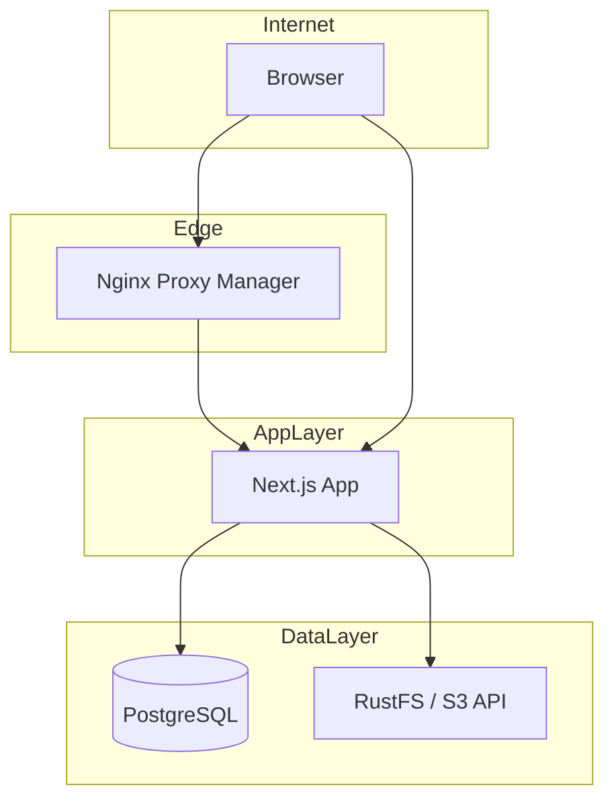

# Building My Personal Website from Zero: Architecture, Tools, and Design Decisions

*This post is written to demonstrate system design thinking and full-stack implementation: from requirements and constraints to architecture, technology choices, and operational maintenance. It doubles as a technical reference for the project and as interview material.*

---

## Introduction

In software engineering, the question "Build vs. Buy" applies to personal branding as well. I could have used a hosted platform (WordPress, Wix, or a static-site generator with a headless CMS), but I chose to build a custom stack: a **full-stack personal website with a no-code-friendly dashboard**. The goal was to have a single codebase that serves both the **public site** (blog, about, contact, custom pages) and an **admin backend** that non-technical users can use to manage content—without writing code—while still allowing me to iterate on architecture and tooling.

This post walks through how I went from zero to a production-ready system: requirements, high-level and component-level design, technology choices and their trade-offs, dashboard UX decisions, data model, security, deployment, and maintenance. I also highlight where I applied system design principles: single-tenant simplicity, configuration-as-data, abstraction for future flexibility, and operational clarity.

---

## 1. Requirements and Constraints

### Functional requirements

- **Public site:** Home, About, Blog (posts with tags/categories), Contact (form), and arbitrary custom pages (e.g. Portfolio). RSS, sitemap, and basic search. Responsive and accessible.
- **Dashboard:** One admin user; no multi-tenant or RBAC. Content management for: site settings (name, logo, nav, footer, meta, OG image), home page (hero, CTAs, skills, section order/visibility), About (profile, education/experience/projects/skills/achievements, section visibility), Contact copy, custom pages (Markdown), and blog posts (Markdown, tags, draft/publish, version history, preview links). Media library (upload, list, insert into posts/pages). Optional analytics view.
- **Non-code users:** The dashboard should be usable by someone without a CS background: setup wizard, inline help, drag-and-drop where order matters, templates (Personal/Portfolio/Blog), and "Insert image" / "Insert button" in editors.

### Non-functional requirements

- **Hosting:** Self-hosted on a single VM (or equivalent). No dependency on a specific cloud vendor for core functionality.
- **Persistence:** Relational data (posts, config, custom pages, about) in a database; binary assets (images) in object storage. No storing large binaries in the database.
- **Security:** Authentication for the dashboard and write APIs; secrets in environment variables; no credentials in the repo.
- **Operability:** Deploy and run with Docker Compose; migrations run as part of deploy; backups (DB + object storage) and basic maintenance documented.

### Constraints

- **Time and scope:** Single developer; prioritize a working, maintainable system over feature breadth. No billing, no multi-user, no native mobile app.
- **Compatibility:** Use standard interfaces (e.g. S3 API for storage) so that I can swap implementations (e.g. MinIO → RustFS) with minimal code change.

---

## 2. High-Level Architecture

The system is a **three-tier deployment**: reverse proxy (optional) → Next.js app → PostgreSQL + S3-compatible object storage. The Next.js app is the only application service; it handles SSR, API routes, and session-based auth.

*Insert diagram: Internet → optional Nginx → Next.js → PostgreSQL + RustFS.*

**Design decisions:**

- **Monolith app:** One Next.js process handles both the public site and the dashboard. This avoids cross-service auth and deployment complexity and fits a single-VM deployment. If traffic grows, the next step would be to scale the app horizontally and introduce a shared session store (e.g. Redis).
- **Database for relational data:** Posts, tags, site config, custom pages, about config, and analytics are relational and queryable; PostgreSQL is a good fit and Prisma gives a clear schema and migrations.
- **Object storage for binaries:** Images and uploads are stored via the S3 API (RustFS). This keeps the DB small, allows independent scaling and backup of media, and uses a well-understood interface (S3) so that the storage backend can be swapped (e.g. MinIO → RustFS) by changing endpoint and credentials only.
- **Optional reverse proxy:** Nginx Proxy Manager (or any reverse proxy) provides TLS termination and a single public entry point; the app listens on a local port and does not need to handle SSL directly.

---

## 3. Technology Stack and Rationale

| Layer | Choice | Rationale |
|-------|--------|-----------|
| **Framework** | Next.js 16 (App Router) | SSR/SSG, API routes, and front-end in one stack; good DX and deployment story (standalone output). |
| **UI** | React 19, Tailwind CSS 4, shadcn/ui (Radix) | Consistent, accessible components; Tailwind for fast layout and theming; Radix for a11y. |
| **Database** | PostgreSQL 15, Prisma 5 | Robust relational store; Prisma for type-safe access, migrations, and schema clarity. |
| **Object storage** | RustFS (S3-compatible) | Single-service, fast, Apache 2.0; replaced MinIO after its maintenance-mode announcement. Using the S3 API from the start made the migration code-free. |
| **Auth** | NextAuth.js v4 (Credentials) | Simple single-user login; session and middleware protect dashboard and write APIs. |
| **Deployment** | Docker Compose | One file to run app, Postgres, and RustFS; same setup locally and on the server. |

**Abstraction and portability:** The app talks to storage only via the AWS S3 SDK and a small wrapper (`lib/s3.ts`). No MinIO- or RustFS-specific APIs are used. That allowed a seamless move from MinIO to RustFS by changing only configuration (endpoint and credentials). This is a direct application of *depending on interfaces, not implementations*.

---

## 4. Data Model and API Design

### Core entities

- **Post:** title, slug, content (Markdown), description, published, pinned, category, order, previewToken, timestamps; many-to-many with **Tag**. **PostVersion** stores history for rollback and audit.
- **SiteConfig:** Singleton (id = 1). Stores site name, logo, favicon, meta, nav (JSON array of { label, href }), footer, OG image, setupCompleted, templateId, themeMode, autoAddCustomPagesToNav. All dashboard “site settings” read/write this row.
- **SitePageContent:** Keyed by `page` (`home` \| `contact`). JSON content: for home, hero, CTAs, skills, sectionOrder, sectionVisibility; for contact, form copy and config. Keeps page-specific content out of SiteConfig and allows flexible schema per page.
- **CustomPage:** slug, title, content (Markdown), order, published. Rendered at `/page/[slug]`. Order is used by the dashboard list and optional “auto-add to nav.”
- **AboutConfig:** Singleton. Profile image, hero fields, intro, education/experience/project blocks (JSON), technical skills, achievements, sectionOrder, sectionVisibility, contact links. The public About page renders sections in order and skips hidden ones.

**API design:**

- **REST-style routes:** GET/POST/PATCH for resources (e.g. `/api/site-config`, `/api/site-content`, `/api/posts`, `/api/custom-pages`, `/api/about/config`). Session required for all mutating operations; middleware enforces this.
- **Idempotent updates:** PATCH and POST updates merge or replace by resource; no custom RPC-style verbs. This keeps the API predictable and easy to document.
- **Pagination:** The dashboard posts list is paginated (e.g. 20 per page) to avoid loading large result sets; other lists (custom pages, media) are smaller and can be expanded later with cursor or page-based pagination if needed.

---

## 5. Dashboard Design: Why This Shape?

The dashboard is designed so that **content and layout can be changed without code** while still supporting power users (e.g. raw Markdown, slugs, preview links).

### 5.1 Single-tenant, single admin

- One credentials-based user (no sign-up, no roles). This simplifies auth and session handling and matches the “personal site” scope. Multi-tenant or multiple roles would require a different auth model and permission layer.

### 5.2 Configuration as data

- Everything the public site needs to render (nav, home sections, about sections, meta, OG image) is stored in the database (or JSON columns), not in code. Changing the menu or turning off a section does not require a deploy. This is a deliberate *data-driven* design: the app code defines *structure* (how to read and render config), and the data defines *content and layout*.

### 5.3 No-code-first UX

- **Setup wizard:** First-time redirect to a step-by-step flow (site name, logo, nav, footer) with plain-language labels. Skip option still persists current state and marks setup complete.
- **Next steps checklist:** After setup, the dashboard home shows clear actions (add first post, add custom page, edit About, view site) so the next actions are obvious.
- **Inline help (FieldHelp):** Key fields (site name, meta description, OG image, nav link, slug, country code) have a small help icon that explains what the field does and how it is used. Reduces the need to read external docs.
- **Drag-and-drop:** Nav items and home section order use drag handles (e.g. @dnd-kit) so reordering is visual and does not require typing indices or config by hand.
- **Templates:** One-click “Personal,” “Portfolio,” and “Blog” apply preset nav and layout (templateId) and home section order. Users can still edit everything afterward.
- **Insert image / Insert button:** In the custom-page and post editors, toolbar buttons open the media picker and insert Markdown (image or link). Lowers the barrier to adding media without learning Markdown syntax.
- **Preview:** Prominent “Preview” on posts and custom pages opens the public URL in a new tab so authors can verify before publishing.

### 5.4 Section order and visibility

- **Home:** sectionOrder and sectionVisibility in home site-content JSON. Dashboard card: checkboxes for show/hide and drag to reorder (Hero, Latest Articles, Technical Skills). Public home renders only visible sections in the chosen order.
- **About:** sectionOrder and sectionVisibility in AboutConfig. Dashboard card: checkboxes for Education, Experience, Projects, Skills, Achievements. Public About renders only visible sections. Order is fixed in code today but the data model supports future reorder.

This gives non-technical users control over *what* appears and *in what order* without touching code or config files.

### 5.5 Separation of read and write paths

- Public site: read-only queries, cache-friendly where applicable (e.g. revalidate), no auth.
- Dashboard and write APIs: require session; all mutations go through the same APIs. This keeps a clear security boundary and makes it easy to add logging or rate limiting on write paths later.

---

## 6. Security and Auth

- **Authentication:** NextAuth.js credentials provider; password compared against `ADMIN_PASSWORD` from env. Session stored in a cookie; middleware protects `/dashboard/*` and write API routes.
- **Secrets:** No secrets in the repo. `ADMIN_PASSWORD`, `NEXTAUTH_SECRET`, DB password, S3 keys, and contact-form keys live in `.env` (or a secrets manager in production). `.env.example` documents variables without values.
- **Input:** API routes validate and sanitize input; Prisma parameterizes queries to avoid injection. File uploads are constrained (e.g. type/size) and stored in object storage with generated or sanitized names.
- **HTTPS:** In production, TLS is terminated at the reverse proxy; the app sees HTTP from the proxy. `NEXTAUTH_URL` and `NEXT_PUBLIC_SITE_URL` must use HTTPS so that cookies and redirects are correct.

---

## 7. Deployment and CI/CD

### Deployment topology

- **Docker Compose:** Three services—app (Next.js), postgres (PostgreSQL 15), rustfs (RustFS). App depends on Postgres and RustFS health. Volumes: postgres-data, rustfs-data, rustfs-logs, and public (for CV and any local static assets). The app is built as a Next.js standalone image so the container does not need Node for install at runtime.
- **Migrations:** Run *inside* the app container (`docker compose exec app npx prisma migrate deploy`) so the same `DATABASE_URL` is used as at runtime. This avoids “works on host but not in container” issues and keeps one source of truth for DB connectivity.

### CI (continuous integration)

- **Workflow:** GitHub Actions on PR (and manual): install deps, Prisma generate, lint, build. No deploy. Ensures every PR can build before merge and catches schema/type errors early.

### CD (continuous deployment)

- **Optional:** A separate workflow can run on push to `main`: build, then SSH to the server and run a deploy script (e.g. `git pull`, `docker compose build`, `prisma migrate deploy`, restart). This requires GitHub Secrets (deploy host, user, SSH key). If the server is only reachable via a private IP, a self-hosted runner or manual deploy is used instead. CD is documented but not required for the project to function.

---

## 8. Operational Maintenance

- **Backups:** PostgreSQL via `pg_dump` (or equivalent); RustFS by backing up the data volume. Backups should be stored off the server and tested periodically.
- **Updates:** App: pull code, rebuild image, run migrations, restart. DB and RustFS: follow upgrade guides for major versions; test in a staging-like environment if possible.
- **Monitoring:** Health endpoint (`/api/health`) for app and DB. Optional Sentry integration for errors. Logs via `docker compose logs`. No custom metrics stack in the default setup.
- **Cleanup:** Media cleanup (remove objects not referenced in posts/pages) and optional DB maintenance (e.g. VACUUM) as needed.

---

## 9. Diagram Placeholders (for your own figures)

You can replace these with your own diagrams (e.g. draw.io, Excalidraw, or Mermaid rendered to PNG).

- **Figure 1: High-level deployment.** Browser → (optional) Nginx → Next.js container → Postgres + RustFS containers.
- **Figure 2: Request flow (public).** User request → Next.js (SSR or API) → Prisma → Postgres; or Next.js → S3 client → RustFS for media.
- **Figure 3: Request flow (dashboard).** User → /dashboard → Middleware (session) → Dashboard UI; actions → API routes (session) → Prisma/S3.
- **Figure 4: Data model (core).** Entities: Post, Tag, PostVersion, SiteConfig, SitePageContent, CustomPage, AboutConfig; relationships and key fields.
- **Figure 5: Dashboard information architecture.** Sidebar: Home, Analytics, Posts, Notes, Content (Site, Home, Contact, About, Custom pages), Media, Tags. Content sub-tree and where section order/visibility live.

---

## 10. Conclusion and Takeaways

This project is a **full-stack personal website with a no-code-friendly dashboard**, designed for a single tenant and self-hosted deployment. The architecture emphasizes:

- **Simplicity:** One app, one DB, one object store; no microservices unless future scale demands it.
- **Data-driven configuration:** Nav, home sections, about sections, and meta are stored in the DB so that content and layout changes do not require code deploys.
- **Abstraction at boundaries:** S3-compatible storage and a thin wrapper allowed a drop-in replacement of MinIO with RustFS with no application code change.
- **Operational clarity:** Docker Compose, migrations in container, documented env vars, backup and maintenance procedures, and optional CI/CD so that the system is deployable and maintainable by one person.

The dashboard design (wizard, help text, drag-and-drop, templates, section visibility/order, insert image/button, preview) is aimed at making the site manageable by non-developers while keeping the codebase and data model coherent for future extensions (e.g. more section types, block-based editing, or multi-tenant if ever needed).

---

## 11. Future Roadmap

- **CD:** Complete CD setup (or self-hosted runner) when the target server and SSH access are finalized.
- **Block-based editing:** Optional block-based editor for custom pages (heading, text, image, button) alongside or instead of raw Markdown.
- **Monitoring:** Optional Prometheus/Grafana or expanded Sentry usage for performance and reliability.
- **Backup automation:** Scheduled backups (DB + RustFS) and optional restore runbook.
- **Multi-language or i18n:** If the site needs multiple locales, add i18n at the routing and content layer.

---

*Last updated: January 2026. This document reflects the architecture and design of the personal-website project at the time of writing.*
